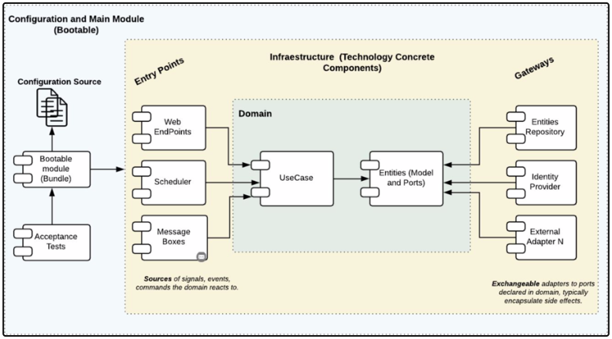
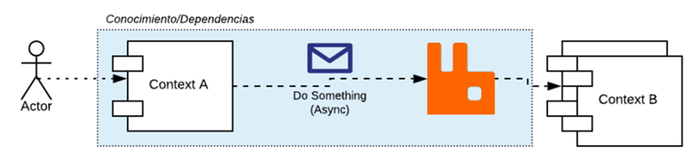
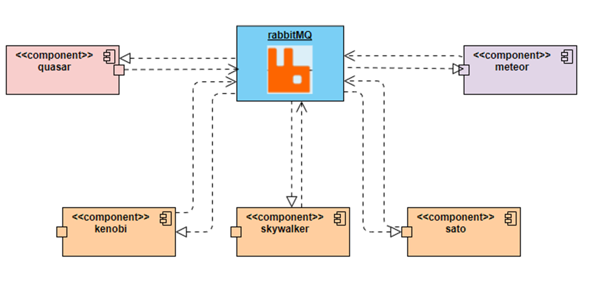
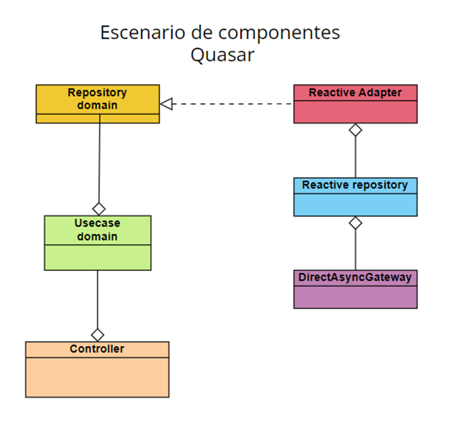
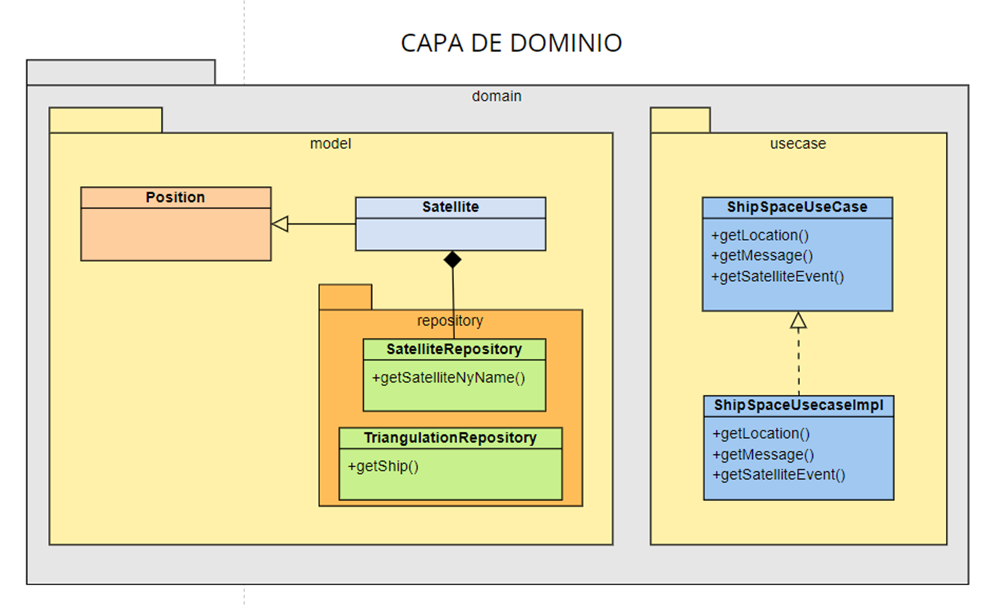
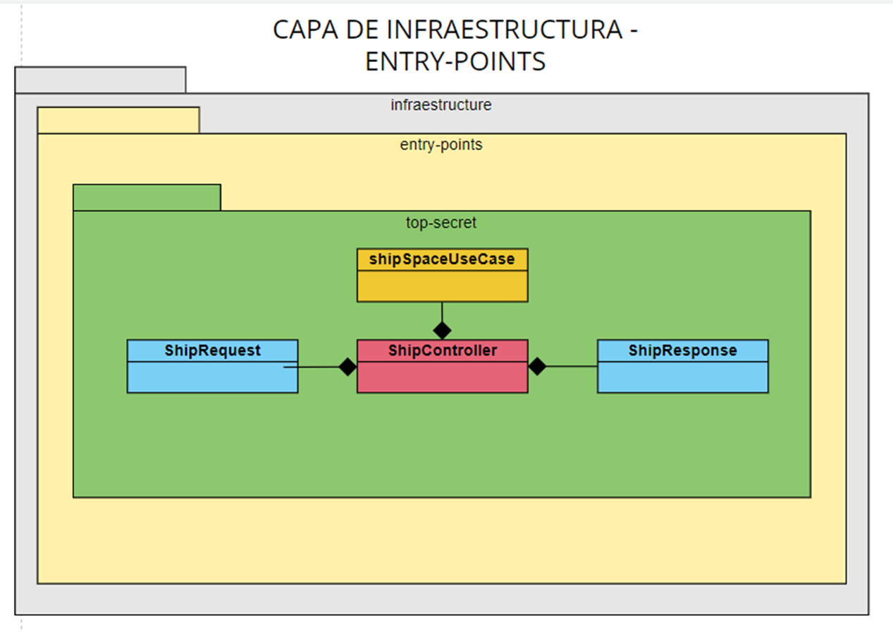
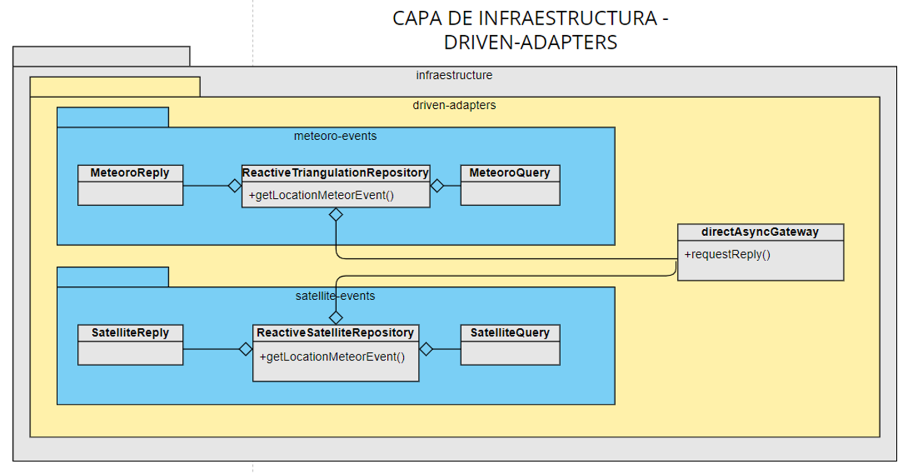
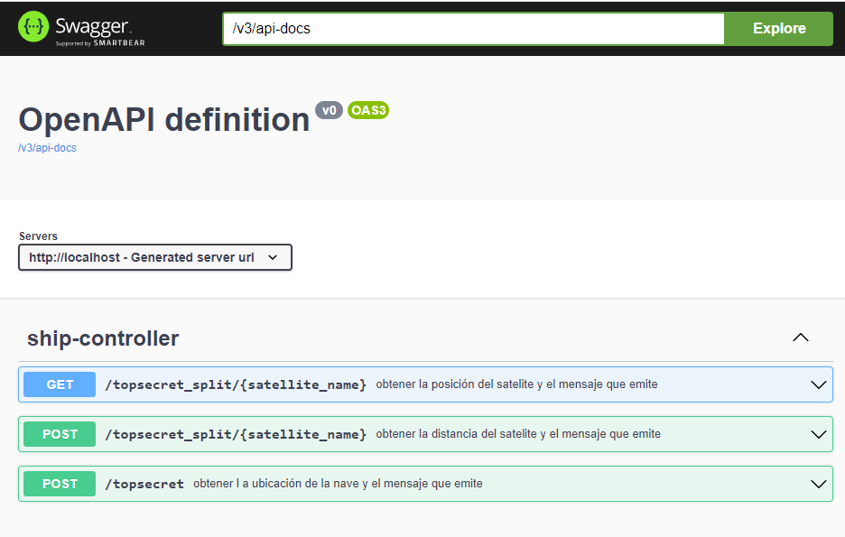
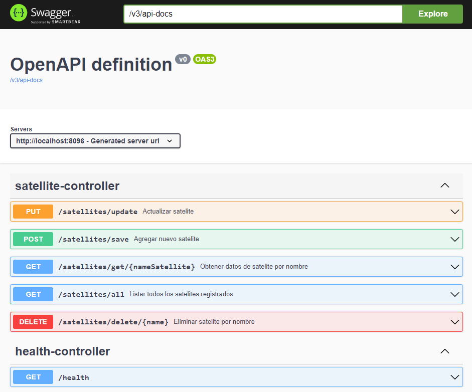
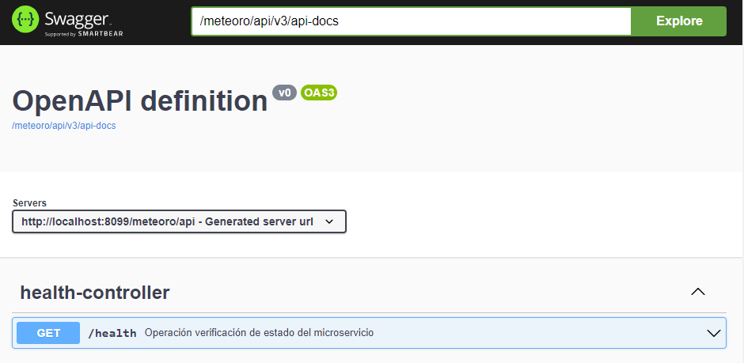

# Quasar

El presente proyecto fue creado bajo el diseño "Clean architecture" el cual permite un bajo acoplamiento entre los componentes asi:



fuente de referencia: https://medium.com/bancolombia-tech/clean-architecture-aislando-los-detalles-4f9530f35d7a

Las técnologías utilizadas fueron:

* Spring-boot
* RabbitMQ
* H2 Database
* Swagger 

# Diseño

A contianuación se ilustra el diseño de los componentes que conforman el microservicio teniendo en cuenta que posee caracteristicas reactivas debido a que es capaz de llamar a eventos expuestos en otros microservicios gracias al broker de mensajeria RabbitMQ con comunicación tipo Request/Reply:


La forma en que se comunica este microservicio con los demás es:

Explicación de los componentes:

| Microservicio            | descripción                                                                                                                                                       | Repositorio | 
|--------------------------|-------------------------------------------------------------------------------------------------------------------------------------------------------------------|-------------|
| quasar                   | Encargado de ser quien expone las capacidades principales de cara al consumidor y que dan solución al reto, se describe como el micro del centro de inteligencia. | https://github.com/dveleper/quasar            |
| kenobi / sywalker / sato | satélites los cuales tienen la función de administrar su información: ubicación, mensajes capturados, distancia frente a la nave a interceptar                    | https://github.com/dveleper/jupiter            | 
| meteor                   | Encargado de prestar el servicio de los cálculos de triangulación.                                                                                                | https://github.com/dveleper/meteoro            |


**RabbitMQ** es un broker de mensajería de código abierto, distribuido y escalable, que sirve como intermediario para la comunicación eficiente entre productores y consumidores. implementa el protocolo mensajería de capa de aplicación AMQP (Advanced Message Queueing Protocol), el cual está enfocado en la comunicación de mensajes asíncronos con garantía de entrega a través de confirmaciones de recepción de mensajes desde el broker al productor y desde los consumidores al broker.

**Diagrama de clases alto nivel:**


**Diagrama detallado**





La documentación de las APIs con Swagger se puede visualizar al desplegar cada componente que posea servicios Rest expuestos:

Quasar:
http://localhost/swagger-ui/index.html


Jupiter: Se ha creado una API Rest con el CRUD de un Satelite con acceso a base de datos en memoria H2.
http://localhost:8096/swagger-ui/index.html


Meteoro:
http://localhost:8099/meteoro/api/swagger-ui/index.html


En la siguiente ruta se puede encontrar una colección de peticiones para postman:


##Puertos por defecto al subir los micros:
| Microservicio            | Puerto    |
|--------------------------|-----------|
| Quasar            | 80    |
| kenobi            | 8096  |
| skywalker            | 8097  |
| sato            | 8098      |
| meteoro            | 8099   |

## Detalle del challenge

Como jefe de comunicaciones rebelde, tu misión es crear un programa en Golang que retorne
la fuente y contenido del mensaje de auxilio. Para esto, cuentas con tres satélites que te
permitirán triangular l a posición, ¡pero cuidado! el mensaje puede no l legar completo a cada
satélite debido al campo de asteroides frente a la nave.
Posición de los satélites actualmente en servicio
##Puertos por defecto al subir los micros:

| Satelite            | coordenadas    |
|--------------------------|-----------|
| Kenobi            | [-500, -200]    |
| Skywalker            | [100, -100]  |
| Sato            | [500, 100]   |


## Nivel 1
Crear un programa con las siguientes firmas:

```
input: distancia al emisor tal cual se recibe en cada satélite
output: las coordenadas ‘x’ e ‘y’ del emisor del mensaje
func GetLocation(distances ...float32) (x, y float32)
```
```
input: el mensaje tal cual es recibido en cada satélite
output: el mensaje tal cual lo genera el emisor del mensaje
func GetMessage(messages ...[]string) (msg string)
```
Consideraciones:
La unidad de distancia en los parámetros de GetLocation es la misma que la que se utiliza para indicar la posición de cada satélite.

El mensaje recibido en cada satélite se recibe en forma de arreglo de strings.

Cuando una palabra del mensaje no pueda ser determinada, se reemplaza por un string en blanco en el array.
Ejemplo: [“este”, “es”, “”, “mensaje”]

Considerar que existe un desfasaje (a determinar) en el mensaje que se recibe en cada
satélite.

Ejemplo:
Kenobi: [“”, “este”, “es”, “un”, “mensaje”]

Skywalker: [“este”, “”, “un”, “mensaje”]

Sato: [“”, ””, ”es”, ””, ”mensaje”]

## Nivel 2
Crear una API REST, hostear esa API en un cloud computing l ibre (Google App Engine,
Amazon AWS, etc), crear el servicio /topsecret/ en donde se pueda obtener l a ubicación de
la nave y el mensaje que emite.

El servicio recibirá la información de la nave a través de un HTTP POST con un payload con el
siguiente formato:

POST → /topsecret/
```
{
    "satellites": [
        {
            "name": "kenobi",
            "distance": 100.0,
            "message": ["este", "", "", "mensaje", ""]
        },
        {
            "name": "skywalker",
            "distance": 115.5,
            "message": ["", "es", "", "", "secreto"]
        },
        {
            "name": "sato",
            "distance": 142.7,
            "message": ["este", "", "un", "", ""]
        }
    ]
}
```
La respuesta, por otro lado, deberá tener la siguiente forma:

RESPONSE CODE: 200
```
{
    "position": {
        "x": 1.3361291,
        "y": 132.52322
    },
    "message": "este es un mensaje secreto"
}
```
En caso que no se pueda determinar la posición o el mensaje, retorna:
RESPONSE CODE: 404

## Nivel 3
Considerar que el mensaje ahora debe poder recibirse en diferentes POST al nuevo servicio /topsecret_split/ , respetando la misma firma que antes. Por ejemplo:

POST → /topsecret_split/{satellite_name}
```
{
    "distance": 100.0,
    "message": "[este,  ,  ,  , mensaje,  ]"
}
```

Crear un nuevo servicio /topsecret_split/ que acepte POST y GET. En el GET la respuesta deberá i ndicar l a posición y el mensaje en caso que sea posible determinarlo y tener la misma estructura del ejemplo del Nivel 2. Caso contrario, deberá responder un mensaje de error indicando que no hay suficiente información.
```
{
    "position": {
        "x": -500.0,
        "y": 200.0
    },
    "message": "[este,  ,  ,  , mensaje,  ]"
}
```